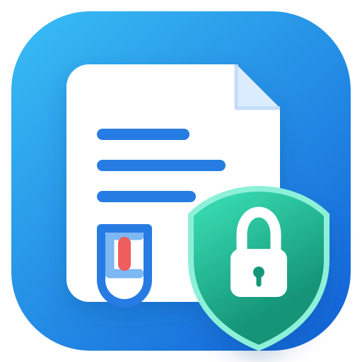

<div align="center">
  

  # Riferto

  **I tuoi referti. Sul tuo dispositivo.**

  PWA privata e local-first per referti medici, valori strutturati e allegati PDF.

  [Apri Riferto](https://making-lemonade.github.io/riferto/) · [Changelog](./CHANGELOG.md) · **Italiano** · [English](./README.md)

  <br>

  
  
  
  
</div>

---

## Cos'è Riferto?

Riferto è una PWA personale per conservare referti sanitari **sul dispositivo dell'utente**. Archivia referti, PDF originali e valori strutturati in un archivio locale protetto da PIN.

Non richiede un server applicativo per conservare i referti. GitHub Pages ospita solo i file statici dell'app; i dati sanitari restano nello storage locale del browser/PWA usato da Riferto.

### Funzioni principali

| | Funzione |
|---|---|
| 🔐 | Archivio locale cifrato per referti e PDF |
| 👥 | Più persone / familiari nello stesso archivio |
| 📈 | Trend nel tempo con grafico, dettaglio e matrice |
| 🧪 | Codici LOINC e normalizzazione prudente orientata a UCUM |
| 📄 | Più PDF originali allegati allo stesso referto |
| 💾 | Backup `.riferto` cifrato con verifica di integrità |
| 📱 | PWA installabile con layout responsive portrait e landscape |

## Privacy e sicurezza

Il vault dei referti e il contenuto dei PDF sono cifrati localmente. Riferto usa una chiave casuale del vault a 256 bit e AES-GCM per i dati protetti; il PIN protegge l'accesso alla chiave tramite un meccanismo basato su PBKDF2-SHA-256.

Riferto è local-first, ma lo storage locale della PWA **non è un backup**. Rimuovere la PWA o cancellare i dati del sito può eliminare l'archivio locale.

### Formato backup

Dalla v0.13.2 il formato principale è un file **`.riferto`**. La struttura logica comprende:

```text
manifest.json
database/
people.json
settings.json
pdf/
```

Il pacchetto viene verificato con SHA-256 e CRC dello ZIP e poi cifrato con AES-GCM prima dell'esportazione. Durante il ripristino Riferto verifica tutto prima di sostituire il database locale; un pacchetto corrotto o incompleto viene rifiutato invece di essere importato parzialmente in silenzio.

Conserva i backup fuori dall'app, per esempio in File, iCloud Drive o un'altra destinazione sotto il tuo controllo. La password del backup è necessaria per il ripristino. I vecchi backup JSON restano importabili per compatibilità.

## Versione corrente

**v0.13.3**

Consulta il [changelog del progetto](./CHANGELOG.md) oppure il [changelog web](https://making-lemonade.github.io/riferto/changelog.html).

## Installazione

Apri:

**https://making-lemonade.github.io/riferto/**

Su iPhone/iPad, apri la pagina in Safari e usa **Condividi → Aggiungi alla schermata Home**. Riferto inizializza l'archivio locale quando viene avviato come PWA installata.

## Standard

LOINC® è un marchio registrato di Regenstrief Institute, Inc. Riferto conserva l'unità riportata dal laboratorio e applica la normalizzazione solo quando è disponibile una conversione esplicitamente supportata.

## Avvertenza medica

Riferto è un archivio personale. **Non è un dispositivo medico** e non fornisce diagnosi né interpretazioni cliniche.

## Licenza e utilizzo

© 2026 Riferto. Tutti i diritti riservati.

Sono vietati il riutilizzo, la redistribuzione, la rivendita, il white-label e l'uso commerciale del software o di parti sostanziali del codice senza preventiva autorizzazione scritta del titolare dei diritti.

---

<div align="center">
  <sub>Riferto · archivio sanitario personale local-first</sub>
</div>
